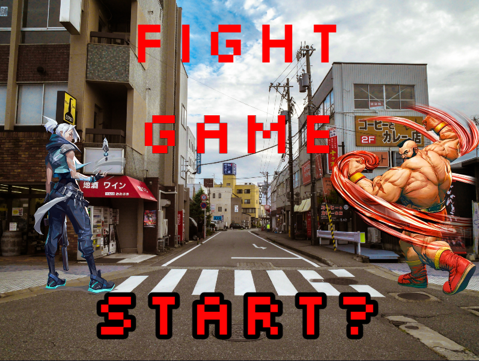
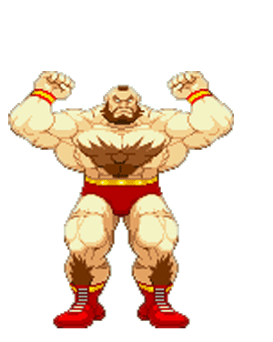
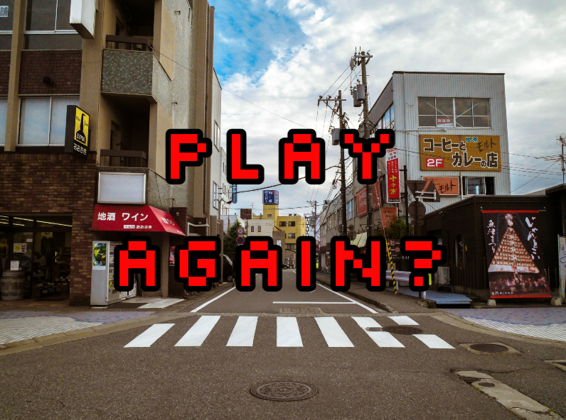

# Fight-Game
A Fighting game similar to Street Fighter,
our applicaton will allow users to play a fighting game with characters from across the multiverse.
We intitially had issues with the GitHub workflow and getting everyong on the same page but now everything is running smoothly. 

# How to play:
We utilized WASD (W - jump, A - left, S - duck/grab, D - Right)
We also used the arrow keys (UP - jump, LEFT - left, DOWN - duck/grab, RIGHT - right)
WASD is for Player 1 and the arrow keys are for Player 2.
**We utilized __WASD__ (W - jump, A - left, S - duck/grab, D - Right)
We also used the __arrow keys__ (UP - jump, LEFT - left, DOWN - duck/grab, RIGHT - right)
WASD is for __Player 1__ and the arrow keys are for __Player 2__.**

All you gotta do is find a friend and pick your characters, one you do that you can fight one another. 
# This game was created by Matthew Bozoukov, James Fleming, and Cameron Hamidy. 

This game is free to use but is not free for profit. 
Last Updated May of 2022.
Made exclusively in Java as it is in 2022.
**Made __exclusively__ in Java as it is in 2022.**
Coded through Eclipse.

